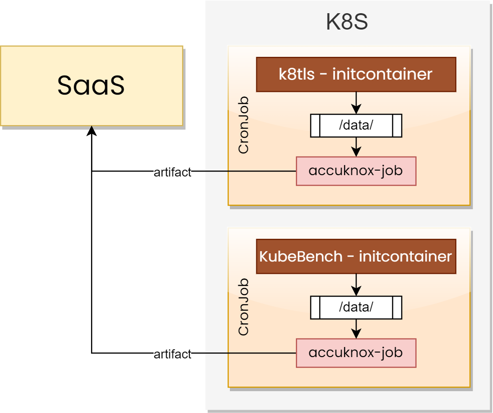

# AccuKnox Jobs

A set of Kubernetes CronJobs that integrate with **AccuKnox SaaS** to perform security scanning, assessment, and reporting.

# Architecture

## K8s CIS Scanning job

[cis-k8s-job](kspm-jobs/cis-k8s-job)

## K8s Service Endpoint scanning job

[k8tls-job](kspm-jobs/k8tls-job)

## Kubernetes Identity and Entitlement Management (KIEM) job

[kiem-job](kspm-jobs/kiem-job)

## Kubernetes Risk Assessment job

[k8s-risk-assessment-job](kspm-jobs/k8s-risk-assessment-job)

## Tenable Nessus job

[nessus-job](nessus-job)

## VM STIG job
[rat-job](rat-job)

## Checkmarx ONE API Docker Job
[cx-one-job](cx-one-job)

## Checkmarx SAST Docker Job
[cx-onprem-sast-job](cx-onprem-sast-job)

## KSPM-Runtime
[kspm-runtim](kspm-runtime)